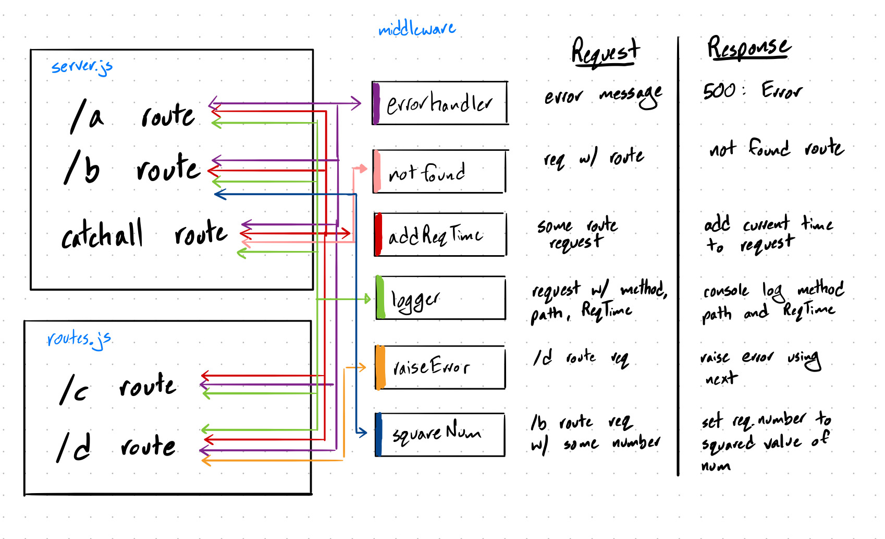

# LAB - 07

## Middleware

### Author: Jagdeep Singh and Jesse Van Volkinburg

### Links and Resources
* [submission PR](https://github.com/401-advanced-javascript-js/lab-07-middleware/pull/2)
* [travis](https://www.travis-ci.com/401-advanced-javascript-js/lab-07-middleware)

#### Documentation
* 

### Modules
#### `addReqTime.js`
###### `addReqTime(req, res, next)`
- Middleware to add timestamp to request

#### `errorHandler.js`
###### `errorHandler(err, req, res, next)`
- Error handler middleware which server console logs error message and also sends the error and status to the front end.

#### `logger.js`
###### `logger(req, res, next)`
- Logger middleware which server console logs the request method, path, and request timestamp.

#### `notFound.js`
###### `notFound(req, res, next)`
- 404 error handler middleware that sends a 404 and message to the front end.

#### `squareNum.js`
###### `squareNum(req, res, next)`
- Middleware that takes in `req.params.number`, squares it, and adds the number to the request.

### Setup
#### `.env` requirements
* `PORT` - Port Number

#### Running the app
* `nodemon`
* Endpoint: `/a`
  * Returns 'Route A' to the front end via res.send()
* Endpoint: `/b`
  * Returns 'Route B' to the front end via res.send()
* Endpoint: `/b/:number`
  * Returns the square of `number` to the front end via res.send()
* Endpoint: `/c`
  * Returns 'Route C' to the front end via res.send()
* Endpoint: `/d`
  * Returns an error to the front end, status code 500
  
#### Tests
* How do you run tests?
* What assertions were made?
* What assertions need to be / should be made?

#### UML

